# Partie 1 : Installation de WordPress

## Prérequis

Dans le cadre de ce workshop, nous développerons un site WordPress en local (sur votre ordinateur) afin d’en tester les différentes fonctionnalités.

Pour déployer votre site WordPress sur un serveur en ligne, vous pouvez vous référer à la partie « Annexes » de ce document qui vous explique la marche à suivre.

**Pour installer WordPress vous avez besoin de :**

* •	Le fichier zip téléchargé sur le site wordpress.org reprenant tous les fichiers et dossiers composant la dernière version de WordPress

* Un pack serveurs web pour développer en local (Apache, PHP, MySQL) (Xampp, Lampp, Wamp)

* Une base de données vide au départ (MySQL) créée préalablement à l'installation de WordPress

* Un logiciel FTP qui permet de transférer les fichiers de votre ordinateur vers votre serveur en ligne.

Le logiciel FTP est nécessaire uniquement lorsque vous mettrez votre site en ligne. Pour ce workshop nous développerons en local. Vous trouverez la procédure pour mettre votre site en ligne dans la partie contenant les annexes.

## Création de la DB avec phpMyAdmin

* Lancer votre serveur Apache (Lampp, Xampp, Wamp)

* Pour Lampp, taper dans la console : sudo /opt/lampp/lampp start

* Dans le navigateur, allez à l’adresse : http://localhost/phpmyadmin/

* Passer la langue en Français

* Utilisateur: root

* Mot de passe : vide, root, user, autres .... selon la configuration lors de l’installation de votre pack serveurs

Veillez à bien connaitre votre nom d’utilisateur et mot de passe pour phpMyAdmin pour pouvoir créer une base de données et vous connecter à celle-ci.

Une fois dans phpMyAdmin, aller sur l’onglet « Bases de données », indiqué le nom de votre base de données. Pour l’exercice, nous l’appellerons « wp_workshop » puis cliquer sur le bouton « créer ».

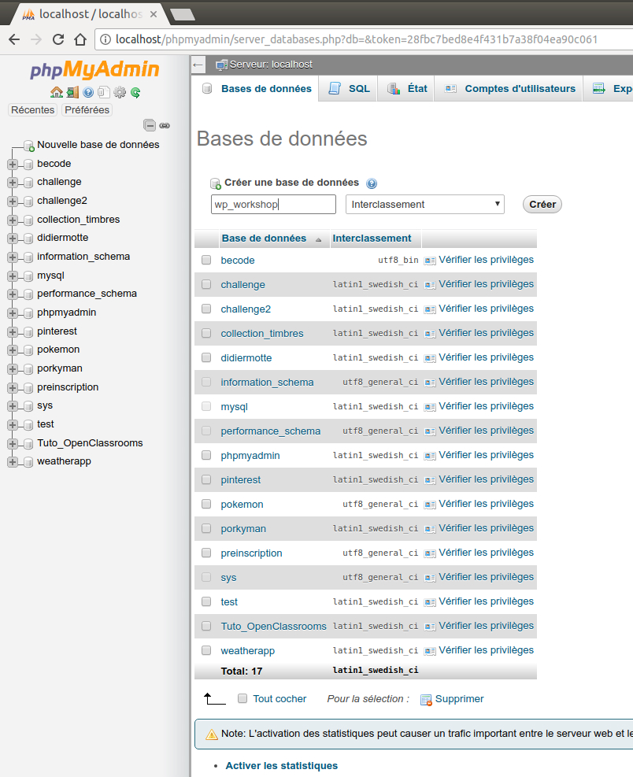

Une nouvelle base de données apparait dans la liste de gauche. Lors de l’installation de WordPress, toutes les tables nécessaires au fonctionnement de WordPress viendront se placer dans cette base de données que nous avons préalablement créée.

**La base de données après l'installation de WordPress :**

## Téléchargement WordPress et installation en local

Site: https://fr.wordpress.org/ (version de l'interface en français ou anglais)

Site: https://wordpress.org/ (site avec interface en anglais - attention format date)

**Site WordPress.org en français**

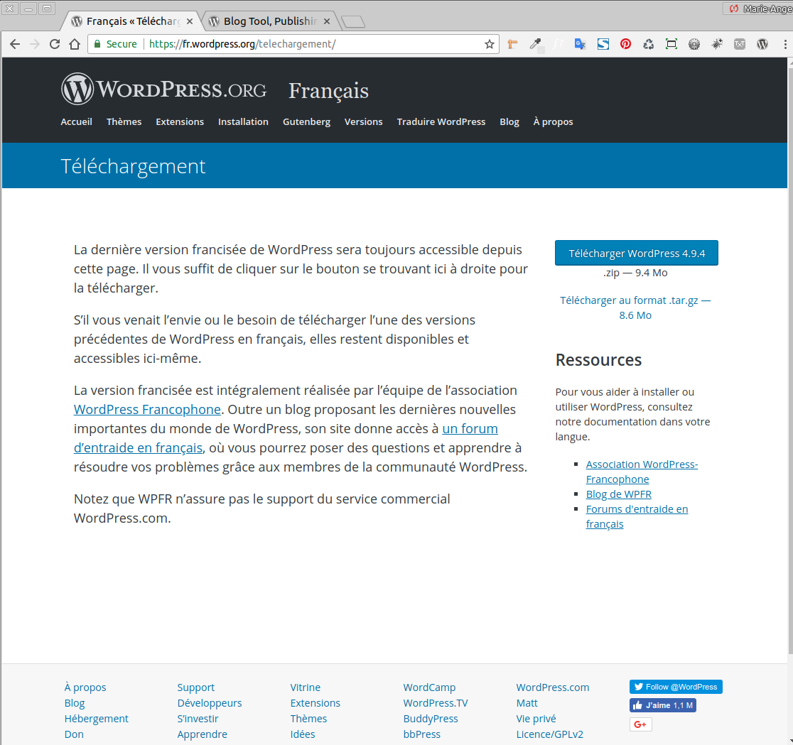

**Site WordPress.org en anglais**

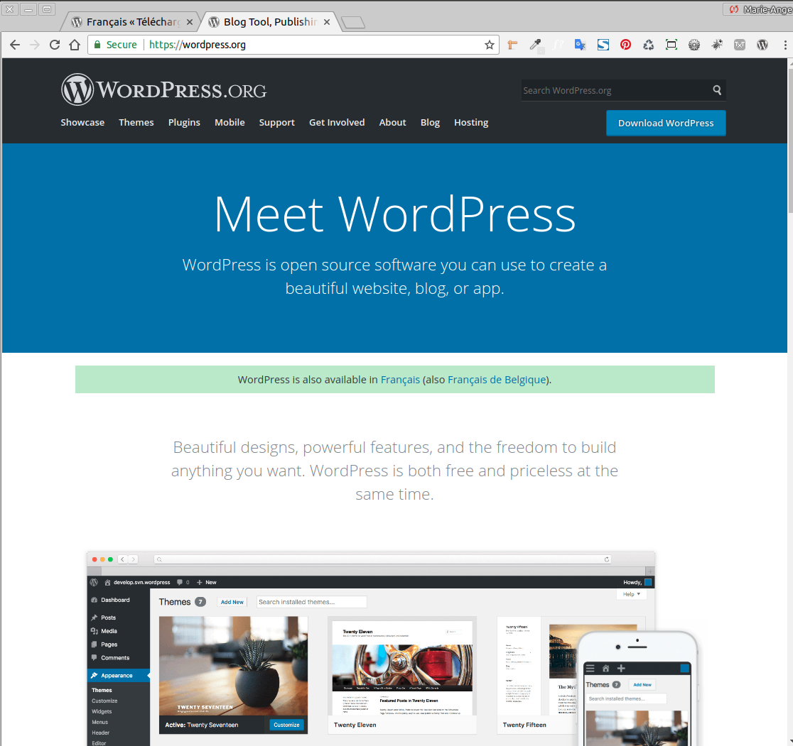

**Attention :**

Ne confondez pas wordpress.org avec les sites https://fr.wordpress.com ou https://wordpress.com qui proposent une formule d’hébergement intégrée et gratuite de votre site WordPress, mais dont les fonctionnalités, la possibilité de personnalisation, l’espace de stockage sont nettement plus limités que ceux de la version complète de WordPress. De plus votre site peut à tout moment est supprimé unilatéralement par WordPress.com qui en assure l’hébergement.

Nous utiliserons donc dans ce workshop la version complète de WordPress téléchargée sur le site de WordPress.org et installée en local sur votre ordinateur (consulter la partie « Annexes » pour apprendre la marche à suive pour l’installation sur un serveur en ligne et l’acquisition d’un nom de domaine).

Libre à vous ensuite de choisir une formule plutôt que l’autre selon vos besoins en étant correctement informé sur les avantages et les inconvénients qu’offre chacune de ses formules.

Pour en savoir plus sur la différence entre WordPress.org et WordPress.com :

* https://wpformation.com/wordpress-com-vs-wordpress-org-quelle-difference/

* https://wpmarmite.com/wordpress-com-ou-wordpress-org/

Dans la barre de menu, cliquer sur le bouton « Download WordPress », puis sur la nouvelle page qui s’ouvre cliquer sur « Download WordPress 4.9.4 » (ou la dernière version disponible). Un fichier zip est téléchargé sur votre ordinateur. Il contient tout le CMS WordPress de base.

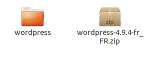

Décompresser ce fichier zip et placer le dossier WordPress dans le répertoire utilisé par votre serveur local (www, html,...).

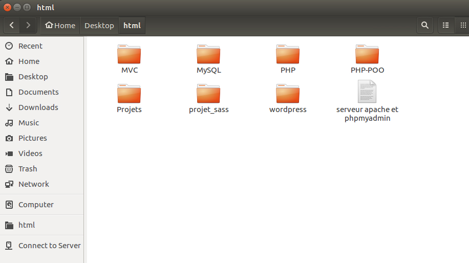

Nous allons à présent renommer ce dossier « wordpress » et nous allons le renommer « wp_workshop ».

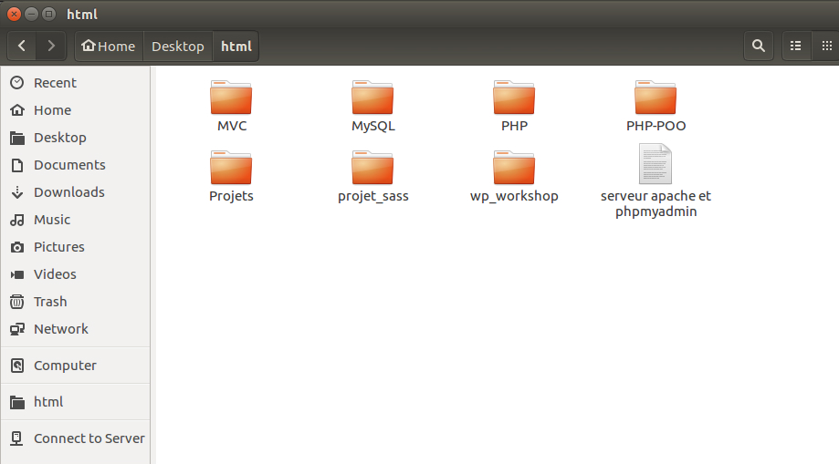

À ce stade, nous avons donc un dossier wp_workshop (contenant tous les dossiers et fichiers de WordPress) dans le répertoire de notre serveur local et une base de données appelée wp_workshop vide crée dans phpMyAdmin. Nous pouvons passer à l’installation de WordPress.

Aller à l’adresse localhost (localhost : 8888 pour Mac utilisant Mamp) sur votre navigateur et cliquer sur le dossier wp_workshop. L’installation de WordPress se lance. Cliquer sur le bouton « C’est parti ! »

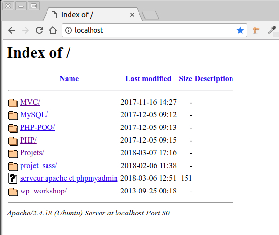

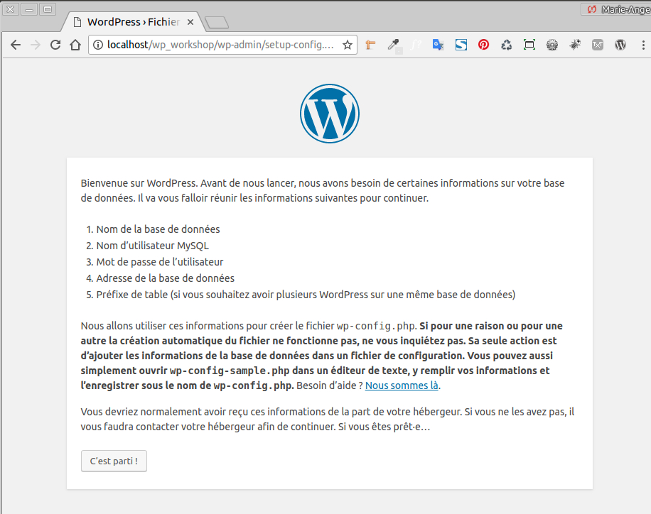

Dans l’écran suivant, on vous demande d’indiquer différentes informations. Remplissez le nom de votre DB soit wp_workshop, **le nom d’utilisateur et le mot de passe avec lesquels vous vous connecter à phpMyAdmin (attention il peut différer de celui indiqué sur l’image)**, laisser localhost dans le champ suivant et afin d’améliorer la sécurité nous allons changer le préfixe qui sera ajouté à toutes les tables WordPress dans la DB par work_ à la place du wp_ par défaut.

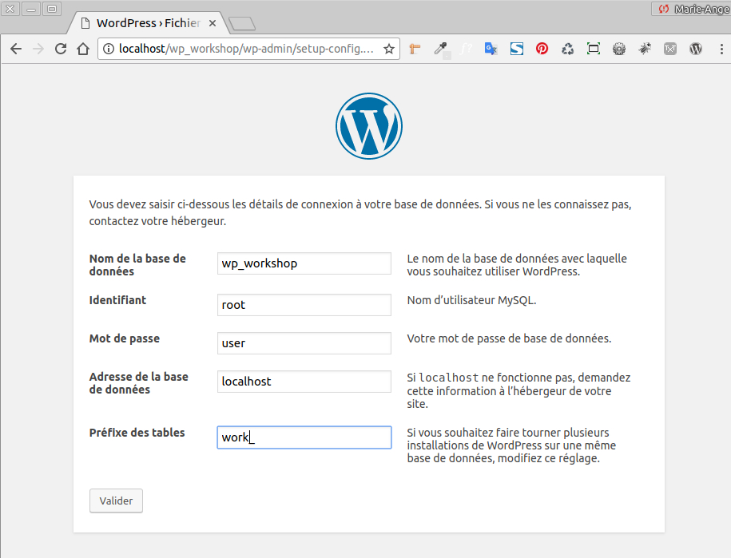

À ce stade il peut arriver qu’une erreur survienne, pas de panique. Cela signifie juste que WordPress n’arrive pas à créer automatiquement le fichier wp-config.php. Pour le créer manuellement, il vous suffit de copier le code se trouvant dans la fenêtre (Ctrl+C), de créer un nouveau fichier appelé wp-config.php à la racine du répertoire wp_workshop, d’y coller le contenu du code et d’enregistrer les modifications.

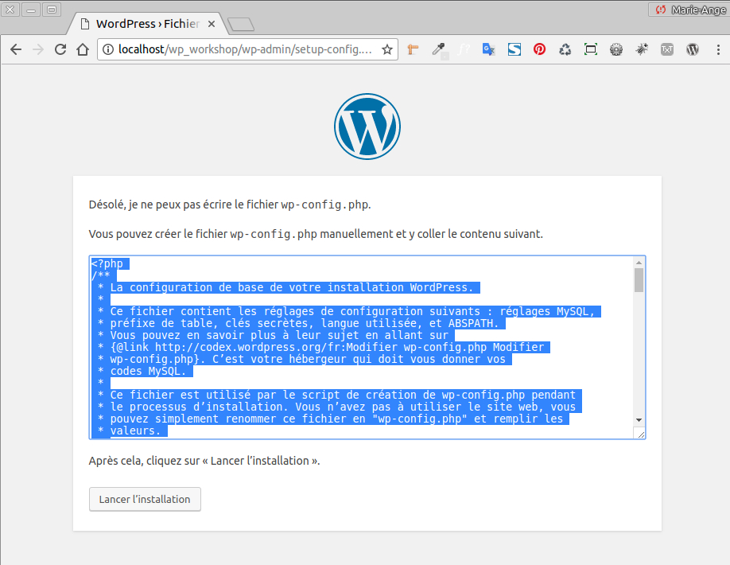

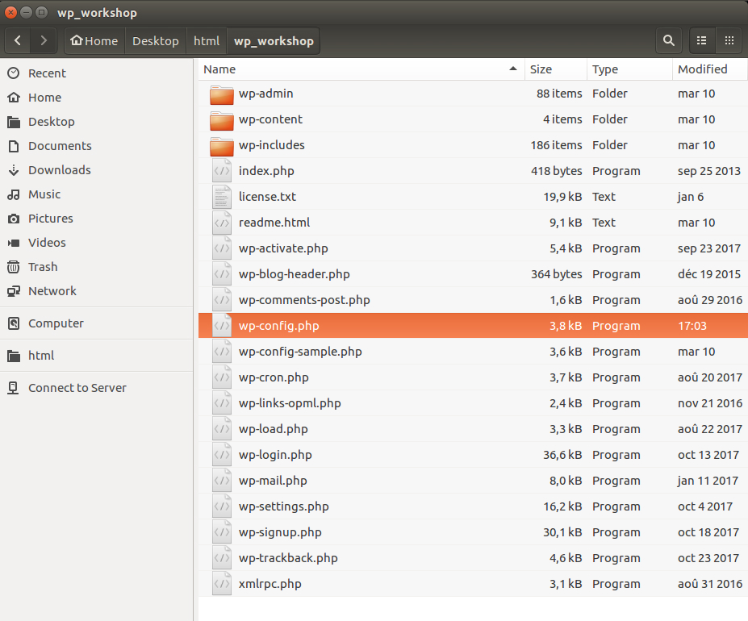

Puis de cliquer sur le bouton « Lancer l’installation »

Dans la fenêtre suivante on vous demande de renseigner les informations concernant votre site, le nom d’utilisateur et le mot de passe que vous utiliserait pour vous connecter à l’interface d’administration de WordPress.

Pour le titre de site indiqué par exemple: WordPress Workshop

Username : admin (pour l’exercice laisser admin, mais pour un site réel, je vous conseille de le changer, ce sera encore possible par après).

WordPress génère un mot de passe sécurisé par défaut contenant des majuscules, minuscules et caractères spéciaux, vous pouvez garder celui qui a été généré aléatoirement pour votre site ou utiliser un site du type https://www.motdepasse.xyz/pour en générer un sur mesure. Veillez à ce qu’il affiche un niveau de sécurité "Forte".

**Attention :** À cette étape, faites bien en copier-coller de votre mot de passe dans un fichier ou notez-le sur un morceau de papier, car sans ces informations vous ne pourrez pas vous connecter à l’interface d’administration de votre site.

Indiquez votre adresse mail et ne cochez pas la mention « Discourage search engines from indexing this site », car nous voulons que les moteurs de recherche indexent notre site dès qu’il sera placé en ligne.

Cliquer sur le bouton « Installer WordPress ».

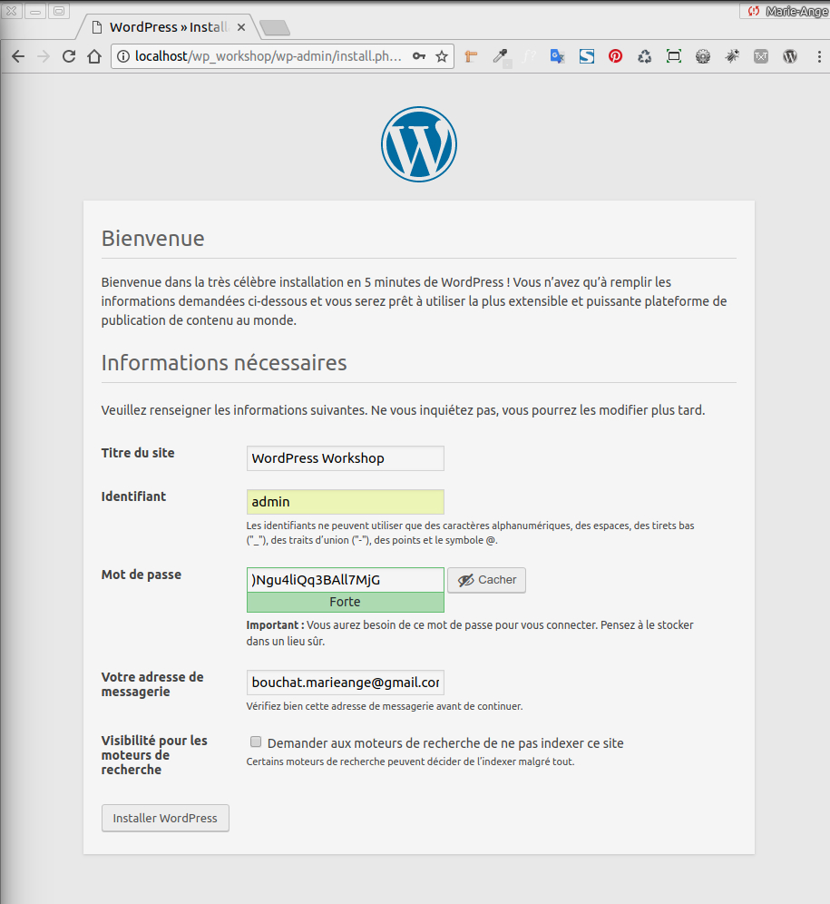

Quel succès! Voilà votre site WordPress est installé en local sur votre ordinateur. Cliquez sur le bouton « Se connecter » pour vous connecter à l’interface d’administration de votre site.

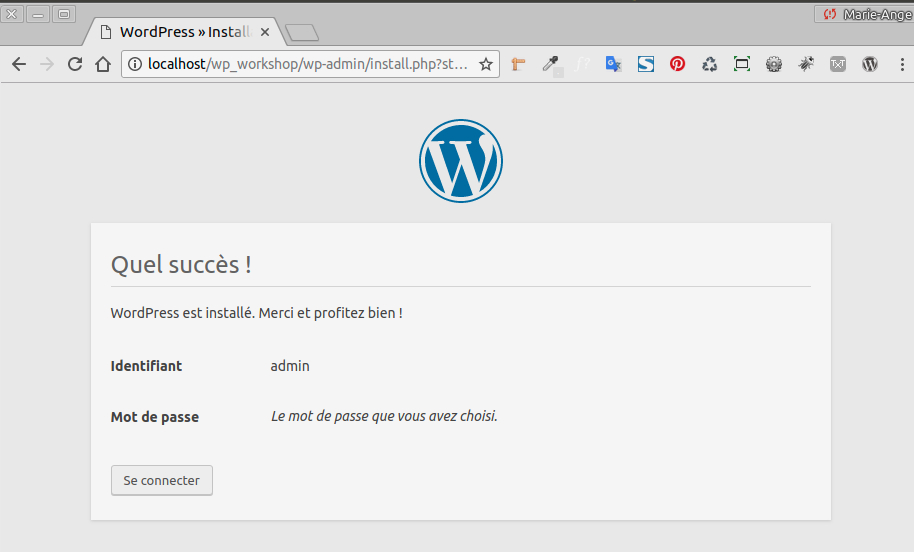

**Remarque:**

À ce stade, si on se rend dans phpMyAdmin (localhost/phpMyAdmin) on peut constater que toutes les tables de WordPress (précédée du suffixe personnalisé work_ que nous avions indiqué) ont bien été placées lors de l’installation de WordPress dans la base de données vide que nous avions précédemment créée.

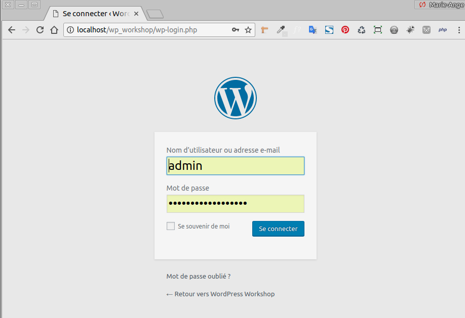

Vous arriver sur la page de login de votre site. C’est à cet endroit que vous vous connectez à l’interface d’administration avec le nom d’utilisateur (admin) et le mot de passe que vous avez noté à l’étape de Bienvenue de WordPress (et que vous avez noté et conservé précieusement).

Vous pouvez voir que l’URL de votre site actuellement sur votre ordinateur en local est :

http://localhost/wp_workshop/wp-login.php

C’est cette adresse que vous devrez taper pour vous connecter à votre site en local dorénavant.

L’adresse sera différente lorsque votre site sera installé sur un serveur en ligne et non en local, elle dépendra du nom de domaine que vous avez choisi ex : http://www.monsupersite.be/) et pour accéder à l’interface d’administration http://www.monsupersite.be/wp-admin, mais nous verrons tout à l’heure qu’il est préférable de changer ce /wp-admin commun à tous les sites WordPress par souci de sécurité.

Nous allons à présent pouvoir passer à la seconde partie de ce workshop l’exploration des bases de WordPress.
