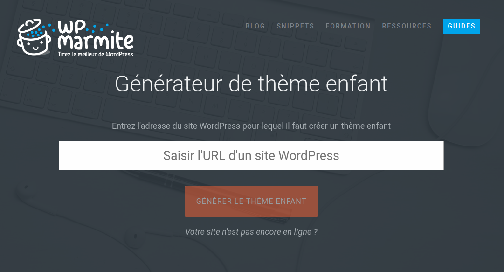
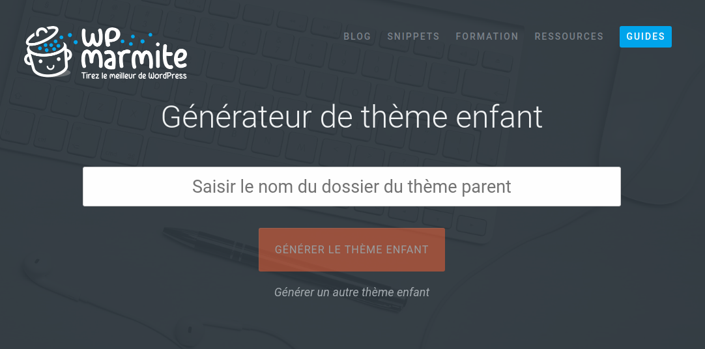
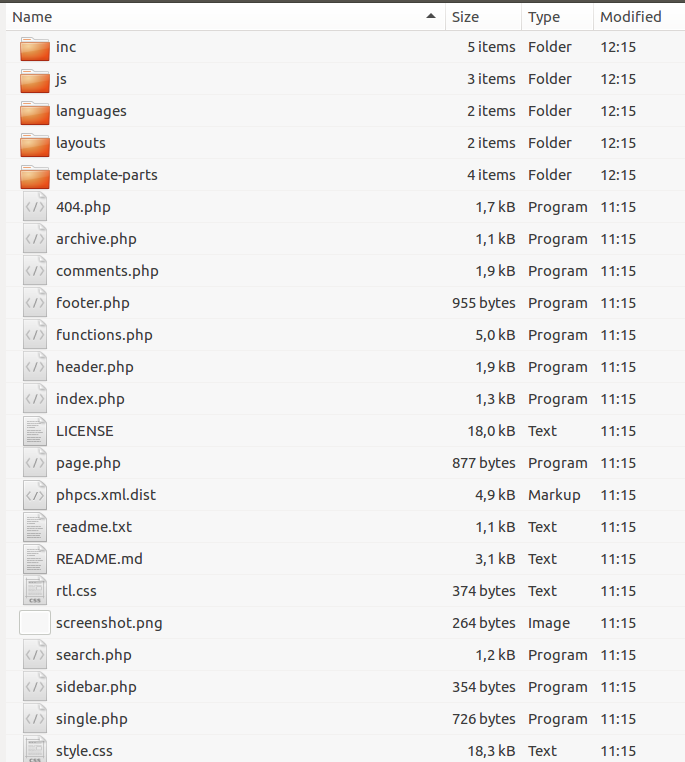

# Partie 4 : Aller plus loin avec WordPress

## La structure des fichiers et dossiers WordPress


ssw
Connaître l’organisation des fichiers dans WordPress est important. La structure est toujours la même, pour un petit site ou pour un gros site : le core ou coeur de WordPress ne change pas.

Les fichiers et dossiers à la racine du site
Les sites WordPress ont tous la même structure. À la racine, vous trouverez les dossiers wp-admin, wp-content, wp-includes et les fichiers WordPress.


### Fichiers et dossiers à la racine du site WordPress.

Il ne faut pas modifier ou supprimer certains fichiers ou dossiers natifs de WordPress, en l’occurrence ceux qui font partie du core, le site risquerait de ne plus fonctionner. De plus, la mise à jour de WordPress écrase toutes les modifications.

**Le dossier wp-admin** contient l’ensemble des fichiers concernant l’administration du site. Il ne faut pas modifier des fichiers dans ce dossier.

**Le dossier wp-content** contient l’ensemble des fichiers des thèmes, des extensions et des médias. C’est dans ce dossier que s’effectuent les modifications et personnalisations du site.

**Le dossier wp-includes** contient l’ensemble des fichiers du core de WordPress (classes, fonctions, scripts…). Il ne faut pas modifier des fichiers dans ce dossier.

**Le fichier wp-config.php** est un fichier généré lors de l’installation de WordPress, à partir du fichier wp-config-sample.php. Les informations qui ont servi à la configuration du site se trouvent dans ce fichier : le nom de la base de données, le mot de passe, l’URL de la base de données, le préfixe des tables, les clés de sécurité, les langues… Ce fichier est modifié lors du changement d’hébergeur, lors de l’optimisation du site, du débogage, lors d’un changement de langue… La suppression du fichier wp-config.php réaffiche la page de configuration.

**Les autres fichiers .php** servent au core de WordPress et il ne faut absolument pas les modifier ou les supprimer. Cependant, vous pouvez trouver à la racine du site des fichiers qui ont été générés par une extension, certains pourront être modifiés : .htaccess, robots.txt ou sitemap.xml…

#### Le dossier wp-content

**Le dossier wp-content** est le dossier servant à la création de thèmes, d’extensions, de fonctions. Il contient les dossiers languages, plugins, themes et le fichier index.php.

D’autres dossiers apparaissent lors d’ajout d’images, comme le **dossier uploads**, et lors de mises à jour, tel le **dossier upgrade**.

D’autres dossiers peuvent encore apparaître selon l’installation de certaines extensions, comme le **dossier cache**.

Dossiers et fichiers du répertoire wp-content, lors de l’installation de WordPress.

**Le dossier languages** contient les fichiers de langue de WordPress. L’installation manuelle s’effectue en téléchargeant par FTP les fichiers de langue dans ce dossier. Les fichiers de langue ont les extensions .mo et .po/.pot.

**Le dossier plugins** contient l’ensemble des extensions installées. De base, le dossier contient deux extensions : Akismet et Hello Dolly. L’installation
manuelle s’effectue en téléchargeant par FTP le dossier contenant les fichiers de l’extension dans le dossier plugins.

**Le dossier themes** contient l’ensemble des thèmes installés. De base, il y a trois thèmes : Twenty Fourteen, Twenty Thirteen, Twenty Twelve. L’installation manuelle s’effectue en téléchargeant par FTP le dossier contenant les fichiers et dossiers du thème dans le dossier themes.

**Le dossier uploads** contient l’ensemble des médias téléchargés. Pour les images, WordPress crée trois formats d’image et les classe selon les paramètres entrés dans l’administration. Par défaut WordPress classe les médias dans des dossiers ayant pour nom l’année, avec à l’intérieur des dossiers ayant pour nom les mois en chiffres (01, 02, … 12). Certaines extensions y créent parfois des dossiers pour y stocker divers fichiers.

**Le dossier upgrade** accueille les fichiers compressés des mises à jour de thèmes ou d’extensions. Avant leur décompression, WordPress les télécharge dans ce dossier. Si la mise à jour se passe mal, vous retrouvez le fichier compressé dans ce dossier. Ce dossier apparaîtra lorsque vous effectuerez une mise à jour.

**Le fichier index.php** sert uniquement à la sécurité du dossier wp-content. Ce fichier vide permet d’afficher une page blanche au lieu de l’arborescence du site en cas de dysfonctionnement. Vous le retrouvez dans différents dossiers.

Source: http://wordpress.laurentdumoulin.com/premier-pas/la-structure-des-fichiers-et-dossiers-wordpress/

## Création et personnalisation de thèmes

Parmi tous les fichiers et dossiers qui constitue un site WordPress, pour la personnalisation, la création de thème ou de plugins et widgets, vous devrez uniquement aller dans le dossier wp-content.

### Création thème enfant
https://wpmarmite.com/creer-theme-enfant/

Un thème enfant est une sorte de sous-thème qui permet de personnaliser l'apparence de son site.

Il est conseillé de créer votre thème enfant dès le départ de votre travail sur votre site WordPress. Cela vous évitera de perdre parfois certains réglages si vous l'installer sur un site déja existant.

Créer un thème enfant est INDISPENSABLE si vous désirez personnalisé votre thème même si ce n'est que pour modifier quelques petits details. Le thème enfant bénéficie de la notion d'héritage du thème parent. En gros vous bénéficier des même options que votre thème parent avec lequel votre thème enfant est lié mais dans votre thème enfant ne vont se trouver que les fichiers que vous avez modifié.

Pourquoi ne pas modifier directement les fichiers dans le thème parent?
Tout simplement parce que les thèmes sont mis à jour régulièrement et il est nécessaire d'effectuer ces mises à jour dès qu'elles sont disponibles pour éviter des failles de sécurité, corrigé d'éventuels bugs et assuré la compatibilité avec la dernière version de WordPress.

Si vous faites vos modifications par exemple directement dans les fichiers de votre thème, la mise à jour de celui-ci viendra écraser toutes vos modifications et tout sera à refaire. Grâce au thème enfant vous pouvez mettre le thème à jour en tout sécurité, et vos fichiers modifiés resterons protégé dans votre thème enfant mais toujous lié à la nouvelle version du thème parent.


**Comment créer un thème enfant**

* Positionner vous dans le dossier de votre site dans "wp-content" --> "themes"
Vous retrouver à cet endroit un dossier pour chaque thème installé sur votre site (installé ne veut pas dire activé). Actuellement vous aurez les theme "twentyfifteen", "twentyseventeen" et "twentysixteen" qui sont installés par défaut avec la version 4.9.4 de WordPress. ainsi qu'un fichier index.php.

**Remarque importante**

Si vous ouvrez le fichier index.php vous ne trouverez pas de balise fermante ?> pour le PHP. Il ne s'agit pas d'une erreur. Si on fermait cette balise, automatiquement les autres parties de code liée à celle-ci ne s'exécuterait plus. Donc **ne fermer pas la balise PHP ?> c'est normal qu'elle ne soit pas présente.**

A cet endroit nous allons créer un nouveau dossier qui va porter le nom du thème parent suivi de la mention "child". Donc par exemple si c'est le thème parent twentyfifteen qui est le plus proche du résultat que lon veut obtenir et que l'on veut customiser un peu, on va créer un dossier "twentyseventeen_child" (Attention éviter les espace, et les caractères accentués et majuscule dans le nom de votre theme enfant). Vous pouvez lui donner un autre nom comme "mon_theme_a_moi" mais l'avantage de reprendre le nom du thème parent suivi de child permet en un coup d'oeil de savoir quel est le thème de base.

Pour les utilisateurs de Linux: si vous avez un soucis pour créer un dossier, c'est que vous n'avez pas les droit administrateur sur votre dossier. On va arranger cela.

1. Aller dans le dossier de votre serveur où se trouve le dossier de votre site en local.

2. Click droit "Open in terminal"

3. Vous devriez avoir un chemin dans la console qui resemble à ça

```
user@nb25:~/Desktop/html$
```

ou à ça

````
user@nb25:/opt/lampp/htdocs$
````

4. Taper la commande suivantes

```
sudo chmod -R 775 wp_workshop
```

Cette commande vous donne les droits administrateur sur votre dossier WordPress

5. Vous pouvez à présent créer un dossier "twentyseventeen_child" dans wp-content --> themes

**Remarque importante:**

Nous allons appliqué sur notre site le thème enfant mais le thème parent de ce site devra toujours rester installé sur votre site. Vous ne devez jamais le supprimé car c'est à l'intérieur de celui-ci que votre thème enfant va chercher la majorité de ses fonctionnalité. Votre thème enfant ne contient que les fichiers que vous avez personnalisés.

Dans le dossier "twentyseventeen_child", nous allons placé un fichier qui va permet d'effectuer le lien entre le thème parent et le thème enfant. Ce fichier doit obligatoirement contenir toutes une série d'information.

Il existe un outil qui vous génère automatiquement ce fichier à cet endroit
https://wpmarmite.com/creer-theme-enfant/, mais vous verrez que wpmarmite qui l'a créer fait clairement sa pub à l'intérieur.





Les fichiers générés sont bien fait mais le nom de WP-Marmite est très présent dans le fichier style.CSS et le logo wpmarmite figure sur le screenshot de la vignette du thème enfant.

Vous pouvez bien entendu modifié cela voici pour exemple le code de mes fichiers une fois modifiés

**Fichier style.CSS**

```
/*
Theme Name: twentyseventeen_child
Description: Theme enfant du theme twentyseventeen
Author: Marie-Ange Bouchat
Author URI: https://github.com/bouchat-marieange
Template: twentyseventeen
Version: 1.0
*/
```

**Fichier screenshot.jpg**

screenshot.jpeg (une image format jpg d'une dimension de 1200 x 900 pixels)
Vous pouvez dans un premier temps garder celle générer par wordpress ou en créer une vous-même. Lorsque vous aurez personnalisé votre thème, je vous conseille alors de faire une capture d'écran du thème modifié de la recadrer au format 1200 x 900 pixels et de l'utiliser comme vignette pour votre theme enfant (vous aurez ainsi un visuel plus réaliste)


**Fichier functions.php**

Ce fichier est parfait tel qu'il est et ne nécessite aucune modification

```
<?php

/* Chargement de la feuille du style du theme parent */
add_action( 'wp_enqueue_scripts', 'wpchild_enqueue_styles' );
function wpchild_enqueue_styles(){
  wp_enqueue_style( 'wpm-/home/user/Desktop/html/wp_workshop/wp-content/themes-style', get_template_directory_uri() . '/style.css' );
}
```

Voilà vous avez créer votre premier thème enfant qui contient les 3 fichiers indispensables : functions. php (qui établit le lien avec le theme parent), screenshot.jpg (qui sera la vignette affichée pour symbolisé votre thème enfant dans l'administration de WordPress), style.css (le fichier qui vous permettra de customiser les différentes partie de votre site grâce au CSS à l 'HTML et au PHP').

**IMPORTANT :**

Pour que cela fonctionne il faut maintenant aller dans votre administration WordPress "Apparence" --> "Thèmes" et **"Activer" votre theme qui apparait dans la liste des theme installé lorsque vous rafraichissez la page**. Faites une prévisulasation en direct, si ça marche "Activer le theme". A partir de maintenant votre site fonctionne en se basant sur le thème parent mais les modifications que vous ferez dans votre thème enfant auront la priorité sur le théme parent et viendront donc remplacer ces parties modifiées par votre version contenue dans le theme enfant.

Voici un petit article bien clair sur le sujet: https://wpformation.com/theme-enfant-wordpress/


### Application pratique du thème enfant - changer l'inscription du footer du site.

Maintenant que vous avez un thème enfant, vous aller copier-coller à l'intérieur les parties de site que vous désirez modifié.

Dans ce petit exercice je vous propose de modifier la phrase par défaut "Fièrement propulsé par WordPress" par un petit copyright personnalisé se mettant automatiquement à jour lorsque l'on change d'année.

exemple: Athénée Robert Catteau 2018 - © HelloWorld-Web tous droits réservés

1. Rendez vous dans le dossier de votre thème parent (twentyseventeen)

2. ouvrez le fichier appelé footer.php (qui correspond contient les infos d'affichage de votre bas de page)

A l'intérieur de celui-ci on ne trouve nul par la mention ""Fièrement propulsé par WordPress", celle-ci doit donc se trouver à un autre endroit. En regardant dans le code, on trouve cette ligne qui nous indique où se trouve la mention que l'on veut modifier:

```
get_template_part( 'template-parts/footer/site', 'info' );
```

Cela nous indique que pour changer la mention il va falloir aller dans le dossier template-part/footer/site-info.phpmyadmin

En effet en ouvrant ce fichier site-info.php on trouve le code suivant:

```
<?php
/**
 * Displays footer site info
 *
 * @package WordPress
 * @subpackage Twenty_Seventeen
 * @since 1.0
 * @version 1.0
 */

?>
<div class="site-info">
	<a href="<?php echo esc_url( __( 'https://wordpress.org/', 'twentyseventeen' ) ); ?>"><?php printf( __( 'Proudly powered by %s', 'twentyseventeen' ), 'WordPress' ); ?></a>
</div><!-- .site-info -->
```

On ne peut pas copier uniquement ce fichier dans notre dossier theme enfant, il faut respecter l'arborescence à partir de la racine du dossier du theme parent (twentyseventeen) . Il faut donc copier et coller tout le dossier "template-parts" dans notre dossier theme enfant (twentyseventeen_child)

4. Ouvrez le fichier avec votre éditeur de texte (Atom, sublim text, ...) site-info.php qui a été copié dans votre thème enfant avec toute son arborescence de dossiers

5. Nous allons pouvoir maintenant le modifier et enregister les modification

**le code original**

```
<?php
/**
 * Displays footer site info
 *
 * @package WordPress
 * @subpackage Twenty_Seventeen
 * @since 1.0
 * @version 1.0
 */

?>

<?php
/**
 * Displays footer site info
 *
 * @package WordPress
 * @subpackage Twenty_Seventeen
 * @since 1.0
 * @version 1.0
 */

?>
<div class="site-info">
	<a href="<?php echo esc_url( __( 'https://wordpress.org/', 'twentyseventeen' ) ); ?>"><?php printf( __( 'Proudly powered by %s', 'twentyseventeen' ), 'WordPress' ); ?></a>
</div><!-- .site-info -->

```

**le code modifié et commenté**

```
<?php
/**
 * Displays footer site info
 *
 * @package WordPress
 * @subpackage Twenty_Seventeen
 * @since 1.0
 * @version 1.0
 */

?>
<!-- Cette ligne ajoute dans votre footer un copyright qui va changer automatiquement chaque année grâce à la fonction PHP date.
On a ajouter en plus de l'id une nouvelle class copyright pour pouvoir la récupérer dans notre fichier style.css et styliser cet élément-->
<p class="copyright" id="footer-info"> 2015-<?php echo date('Y'); ?> BECODE | Mention légales | Site Map</p>

<!-- On modifie égalemeent le "Proudly powered by WordPress" en le remplaçant par Becode
et on change le lien qui redirigeait vers le site de WordPress pour rediriger vers le site de Becode.org -->
<div class="site-info">
	<a href="<?php echo esc_url( __( 'https://www.becode.org/', 'twentyseventeen' ) ); ?>">

<?php printf( __( 'Proudly powered by %s', 'twentyseventeen' ), 'BeCode' );
?>

</a>
</div><!-- .site-info -->
```

**la modification du fichier style.css du theme enfant pour styliser tout ça**

```
/*
Theme Name: twentyseventeen_child
Description: Theme enfant du theme twentyseventeen
Author: Marie-Ange Bouchat
Author URI: https://github.com/bouchat-marieange
Template: twentyseventeen
Version: 1.0
*/

.copyright
{
/* background-color: red; */
text-align: center;
}

.site-info
{
  /* background-color: blue; */
  width: 100%;
  text-align : center;
}
```

6. Enregistrer vos fichier et aller dans votre navigateur voir le résultat après avoir rafraichis la page de votre site et éventuellement vider le cache de votre navigateur. (un extension pratique pour le navigateur chrome pour vider en un click le cache de votre navigateur : https://chrome.google.com/webstore/detail/clear-cache/cppjkneekbjaeellbfkmgnhonkkjfpdn?hl=fr)

Bravo ! Vous venez de réaliser votre première personnalisation de thème !!!

### Création d'un nouveau thème

Un thème à la base est composé de nombreux fichiers pour pouvoir prendre en charge toutes les fonctionnalités proposées par WordPress.

Il ne faut pas pense qu'il s'agit juste d'un ou deux fichiers proposant une mise en page de base. Ca c'est de la personnalisation d'un thème existant à l'aide d'un theme enfant.

Je vous conseille pour commencer d'analyser en détails le code présent dans les fichiers des thèmes fournis par défaut par WordPress. Voyer quel est leurs structure, comment les différents fichiers interagissent entre eux, comment sont implémenté les fonctionnalités principale et les différentes zones de l'affichage (header, footer, contenu, zone de menu, zone de widgets, ...).

Cette première approche vous permettra de déja avoir une vue d'ensemble sur le fonctionnement d'un thème et des prérequis minimum pour en concevoir un vous-même.

Une fois cette étape réalisée, il vous faudra maquetter non pas une page de base mais une série de page pour votre thème pour pouvoir répondre à l'affichage de différents contenu, article seul, liste articles, pages 404, etc...

Voici un tutoriel qui vous explique comment passer de la maquette HD  à la réalisation de votre thème: https://www.youtube.com/watch?v=dIY73_SeGnU

Des outils comme underscores.me peuvent également vous aider à créer automatiquement tout la structure de votre thème avant la phase de personnalisation.


#### Création d'un nouveau thème vierge avec underscores.me

Utiliser le site http://underscores.me/ pour créer un dossier zip portant le nom de votre nouveau thème que vous avez entrer sur le site. Ce dossier zip contient tous les dossiers et fichiers de base d'un dossier thème vierge. Cela vous évite de devoir créer tous ces fichiers manuellement. Il ne vous reste plus qu'à décompresser l'archive zip générée par le site et placer le dossier décompressé dans la structure de votre site WordPress dans le dossier wp-content/themes.



### Création d'extensions (Plugins)

Les plugins ajoutent des fonctionnalités à votre site WordPress. Il y a donc autant de plugin possibles que de fonctionnalités que vous pourriez vouloir intégré.

Afin de mieux cerner les étapes nécessaires à la création de plugin,je vous renvoie vers ce lien:

https://www.youtube.com/watch?v=f4dW5xmeuFE


### Création de widgets

Les widgets sont des composants de navigation qui permettent de facilité la vie des utilisateurs de votre site. (exemple: articles récents, Archives, Categories,...)

Ces widgets permettent d'avoir un accès direct aux articles récents, aux différentes catégories etc... c'est en cela qu'il facilite et simplifie la navigation sur votre site.

Voici une vidéo explicative qui est sur la version 3 de WordPress mais les principes restent identiques: https://www.youtube.com/watch?v=0m63CxVNffY&t=9s

Voici un tutoriel plus complet en 2 parties:

https://www.youtube.com/watch?v=YLdrbuE8mqs

https://www.youtube.com/watch?v=lZwFW_cr5Xg

### Snippets pour personnalisé votre site avec quelques copier-coller de fragment de code

Les snippets sont des petits morceaux de code qui permettent de réaliser des actions ciblées pour organiser votre interface d'administration ou la partie frontend de votre site. Ils permettent de gagner du temps et de personnaliser facilement notre interface d'administration selon nos besoins.

https://wpmarmite.com/snippets/
