# Partie 5 : Maintenance et Optimisation

## Sécurisation

Première mesure essentielle faire une mise à jour régulière de WordPress et de tous vos Plugins

Installer un plugin de sécurité de type SecuPress (français)(https://secupress.me/fr/) ou  Wordfence (anglais), dont les versions gratuites offrent déja un très bon niveau de sécurité.

Une liste des points à sécuriser pour WordPress:https://www.youtube.com/watch?v=jc7E-C6mJY4

Un autre article traitant de cette thématique
https://wpmarmite.com/video/liste-securite-wordpress/

Lorsque vous n'utilisez pas un plugin, désinstaller-le car les pirates informatiques peuvent continuer à exploiter les failles d'un plugin même désactivé pour nuire à votre site.

Voici les étapes de sécurisation de votre site avec le plugin gratuit secupress (en français):

1. Installer SecuPress via l'interface administration de votre site (Extensions --> Ajouter)

2. Activer SecuPress

3. Aller dans réglages en survolant plugins secupress dans la liste des extensions installées

4. Secupress propose de réaliser un scan de votre sites

5. Cliquer en haut sur le bouton "Scanner mon site"

6. Secupress affiche un rapport détaillé des points qu'il est possible d'améliorer.

7. Après avoir visionner les 2 liens (vidéo + article) qui précède afin de comprendre les mesures facile à mettre en place et qui amélioreront grandement la sécurité de votre site.

8. Pour améliorer la sécurité, cliquer sur les points noté comme mauvais sur le petit lien "en savoir plus". La mesure à prendre pour corriger cette faille de sécurité vous est clairement expliquée

9. Procéder aux modifications nécessaires en cliquant sur "Prochaine étape"

10. Cocher les cases souhaitées et cliquer sur le bouton "Corriger" pour que les failles selectionnées soient automatiquement corrigées.

11. Effectuer les opérations manuelles de correction restantes.

12. Effectuer un nouveau scan du site pour voir l'amélioration du niveau de sécurité de votre site.

Vous trouverez des informations complémentaires sur le site de l'éditeur du plugin : https://secupress.me/fr/ . Le support est bien assuré par Julio Potier spécialiste en sécurité internet qui a créer ce plugin. Lisez la documentation (https://secupress.me/fr/support/) ou contacter le support via le formulaire en cas de question ou de problème (https://secupress.me/fr/contact)

## Optimisation

Pour optimiser les performances de votre site, tout d'abord débarasser vous de tous ce que vous n'utiliser pas (comme des plugins désactivé, des articles, et autres contenu par défaut créer par WordPress lors de son installation).

Eviter d'utiliser des plugins qui font double emploi (exemple: vous ne serez pas mieux protéger parce que vous avez 2 plugins de sécurité au lieu d'un)

Le core de WordPress est déja très bien optimisé. Il n'est pas forcément nécessaire d'ajouter des plugins d'optimisation à l'exception peut-être de plugin qui mignie le css et le javascript de votre site pour le rendre plus rapide.

Celui que je vous conseillerai le plus est WP Rocket (payant), mais l'investissement d'environ 50€ est totalement justifier par le gain impressionnant de performance.

WP super cache est gratuit mais ne permet pas un gain important de performance. Je vous le déconseille.

W3 Total Cache à une meilleure réputation et est gratuit.

Eviter d'installer des plugin très lourd et multifonctions si vous n'avez besoion que d'une fonctionnalité précise (exemple: Jetpack). Par contre ce plugin peut s'avérer très puissant et utile si vous vous servez régulièrement de ses nombreuses fonctionnalités.

Il est possible de réaliser des effets graphique comme une galerie d'images sans utiliser de plugin. Renseigner vous sur les possibilité native de WordPresse dans le codex avant de vous jetter sur des plugins.

## Sauvegarde

Attention lorsque l'on sauvegarde son site on peut le faire manuellement via un logiciel FTP de type FileZilla et créer une sauvegarde de son site en faisant une copie du site en ligne sur son ordinateur ou sur tout autre support de stockage physique ou en ligne en n'oubliant pas d'exporter la DB avec phpmyadmin en même temps. On peut également sauvegarder son site en toute facilité en une seule étape et le restaurer avec un plugin dédié. Je vous conseille le plugin UpdraftPlus.

### Sauvegarde manuelle via logiciel FTP

**Attention dans ce cas de ne surtout pas oublier de sauvegarder également la base de données qui contient tous vos contenus internet. Pour cela utliser phpmyadmin:**

1. Aller sur phpmyadmin ou sur le gestionnaire de DB de votre hébergeur.

2. Sélectionner la DB de votre site (ex: wp_workshop)

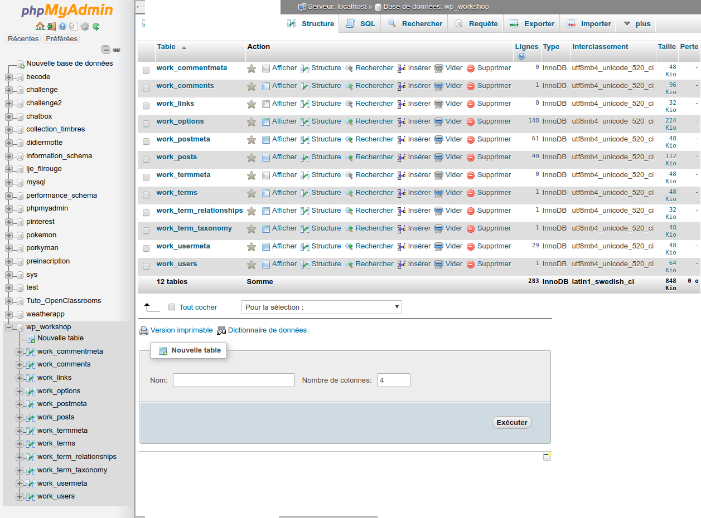

3. Aller dans l'onglet "Exporter"

4. Selectionner le format SQL et "exécuter"

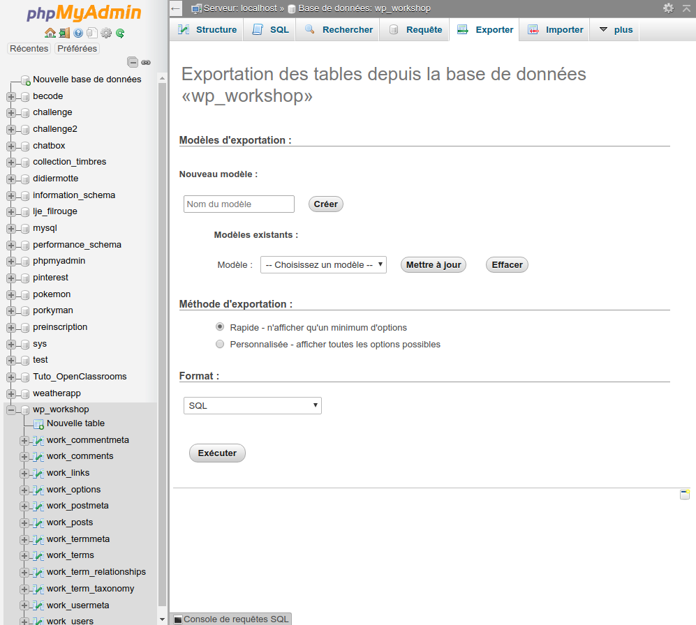

5. Un fichier portant le nom de votre DB avec l'extension .sql est télécharger.

6. Créer à l'endroit de votre sauvegarde un dossier appellé "DB" et placer y le dossier .sql que vous venez de télécharger. Ainsi la sauvegarde de votre DB sera liée à celle de votre site.

Si vous devez restaurer votre site à partir d'une sauvegarde manuelle, vous devrez tout d'abord créer une DB vide portant le nom de la DB de votre site, puis ensuite importer le contenu de la db que vous avez sauvegarder avec phpmyadmin à l'intérieur de celle-ci.

**Attention il est important de faire la sauvegarder de votre site et l'exportation de votre DB au même moment (avant que de nouvelles modifications n'interviennent sur votre site), afin que la sauvegarde de Wordpress corresponde à l'état de la DB au moment de sa sauvegarde.**

### Sauvegarde grâce à un plugin dédié (updraftplus)

Il existe heureusement un plugin très bien conçu qui va vous facilité la vie. Il s'agit du plugin UpdraftPlus (https://fr.wordpress.org/plugins/updraftplus/).

Activer l'application.

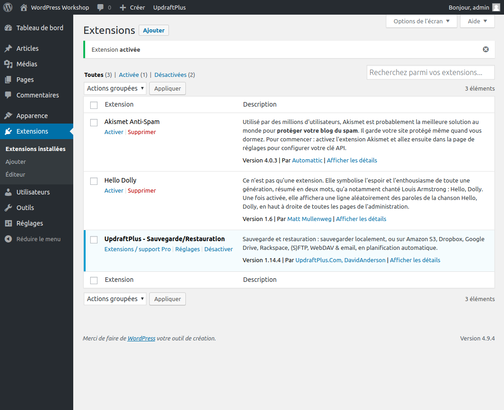

Aller dans "Extensions installées" puis dans UpdraftPlus - Sauvegarde/Restauration "réglages" pour paramètrer les options de sauvegarde et de restauration de votre sites.

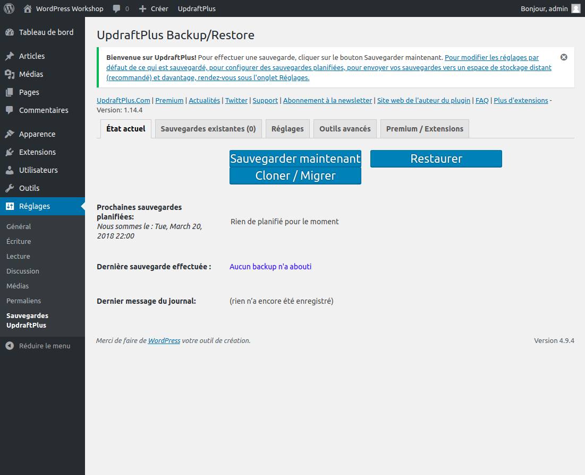

Sauvegarde du site et de la base de données en une seule opérations

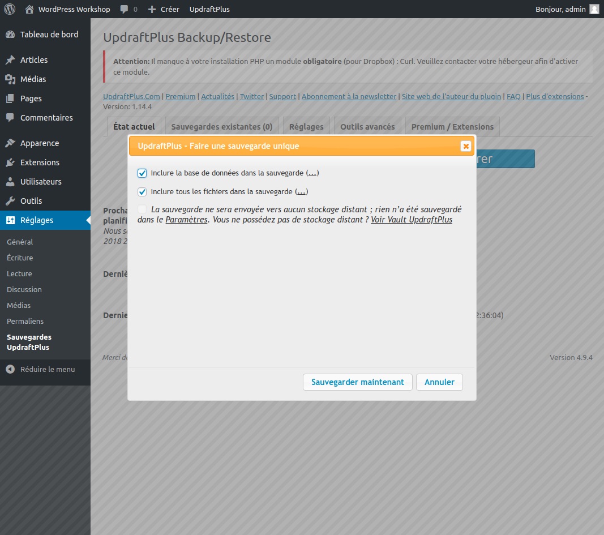

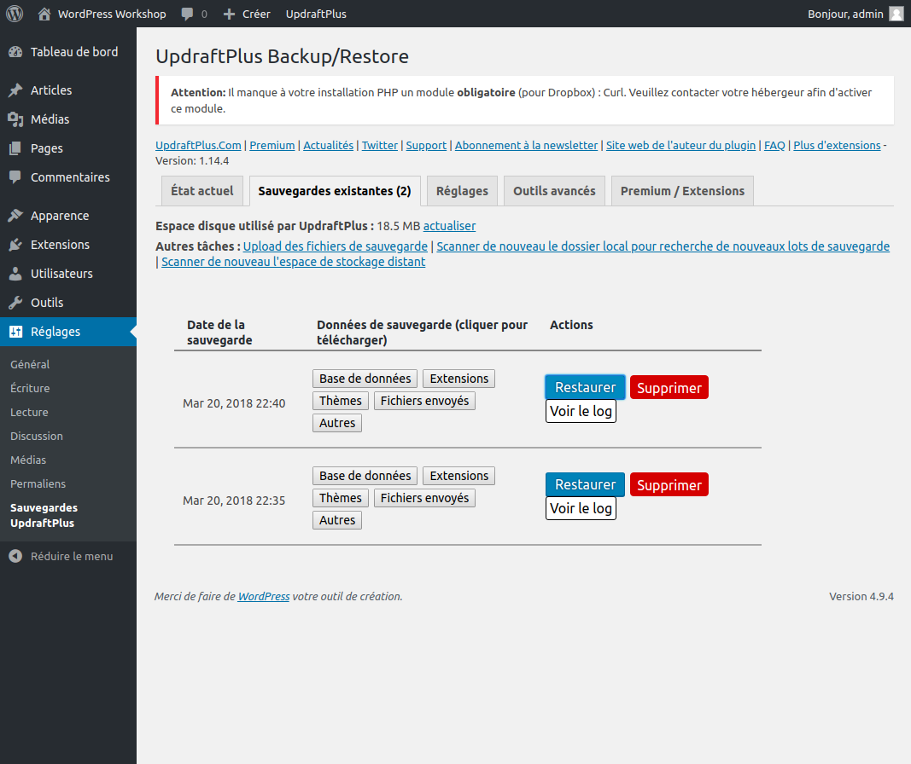

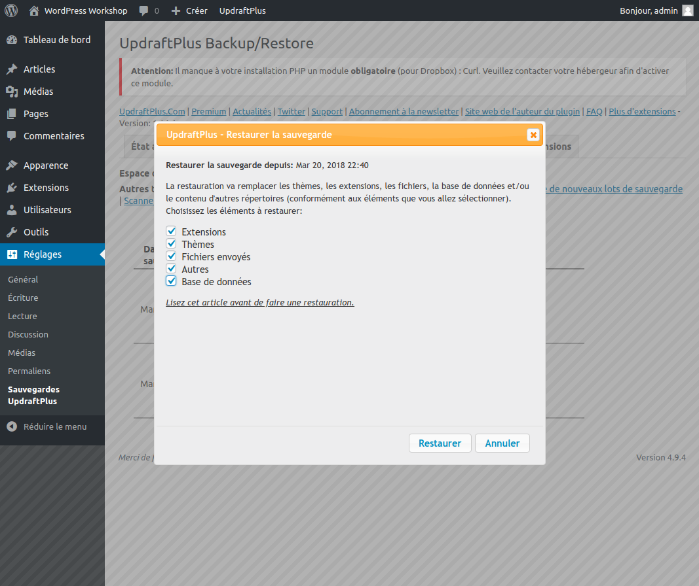

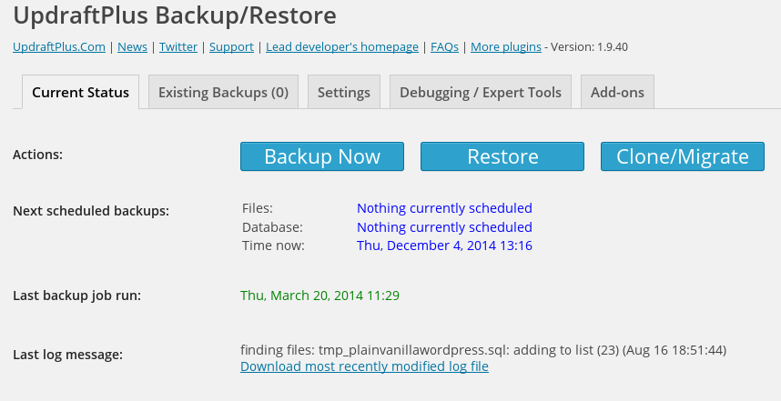

Ce plugin gratuit vous permet non seulement de télécharger en une seule opération tout votre site mais également votre DB et de programmer cette sauvegarde de manière automatique (par exemple tous les jours à 22h00.

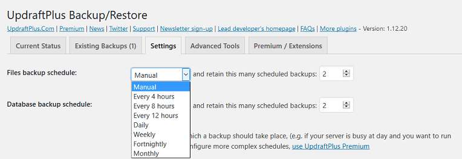

Il vous permet égalemenent de créer une sauvegarde supplémentaire sur un espace distant comme par exemple un espace dropbox.

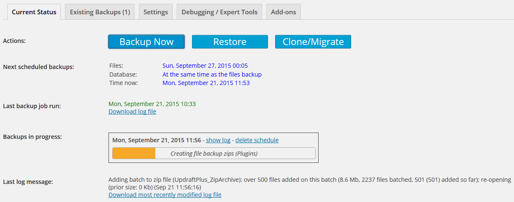

Il permet tout aussi simplement de restaurer votre site mais aussi d'effecturer une migration de celui-ci (sur un autre serveur par exemple).

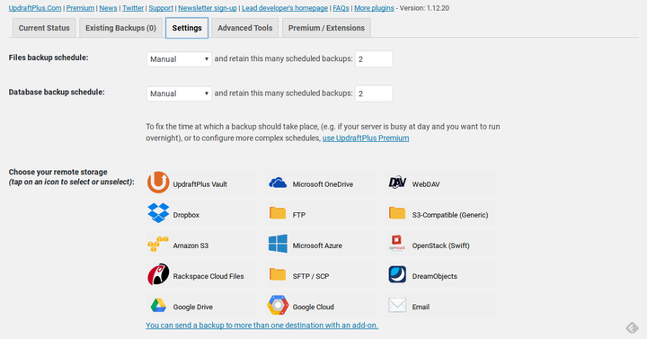

Très simple de prise en main, c'est le plugin de sauvegarde que je vous conseille.

## SEO

Remplissez systematiquement le champ de texte alternatif sur vos image et média.

Veillez à garder un bon niveau de performance car cela influe aussi sur votre classement dans les moteurs de recherche.

Lors de la rédaction de vos articles, veillez à bien choisir les titres mais également à utiliser des mots clefs vous assurant un bon référencement dans le domaine dont traite votre site. Utliser les catégorie (obligatoire), mais utiliser également les étiquettes avec des mots clefs optimisés SEO.

Modifier les permaliens (url) de vos articles afin d'avoir des url propre et dépourvues de mots liens inutiles. Une bonne gestion des permaliens (URL) de vos articles permet une optimisation de l'indexation des pages de votre site et un meilleur référencement.

Commencer toujours par faire une sauvegarde de votre site et de votre base de données (plugin updraftplus) avant de modifier les options de permaliens ou les permaliens directement dans la section "Articles". Choisissez l'option "Nom de l'article" dans "Réglages" --> "Permaliens" dès l'installation de WordPress, car c'est cette option qui offre les meilleurs résultats en matière de référencement. (vous pouvez customiser les différentes parties qui compose l'url en choississant de ne pas inclure la date, l'heure, l'auteur, la categorie ou autres...)

Installer un plugin qui vous permet de gérer efficacement votre référencement (Yoast SEO) et en savoir d'avantage sur les statistiques de votre site (Google Analytics pour WordPress avec MonsterInsights) (mot clefs utilisé dans les recherche, articles qui ont retenus l'attention, taux de rebond, ...) afin de mieux déterminés vos mots clefs, votre public cible, vos horaires de publication ...
